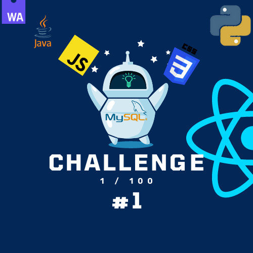

## 

------------------------------ English ------------------------------

# Day 1 

A bit more understanding about JavaScript and its V8 engine.
Who created this engine?
Brendan Eich created the first JavaScript engine called SpiderMonkey.
There are multiple engines for JavaScript. You can find a list of JavaScript engines [here](https://en.wikipedia.org/wiki/List_of_ECMAScript_engines)

How does a computer read a file? It uses a type of translator called an engine.
Chrome uses V8, which is written in C++.
In 2008, Chrome integrated V8 with a new method of compilation called JIT (Just-In-Time).

## What happens when we give a JavaScript file to your engine?
First of all, it performs Lexical Analysis to break down the code and identify its meaning. This abstract syntax is represented as a tree structure called an AST (Abstract Syntax Tree). You can explore an AST using [this demo.](https://en.wikipedia.org/wiki/List_of_ECMAScript_engines)
Then, the code is compiled and executed by the engine to be processed by your CPU. 

------------------------------ FRENCH ------------------------------

Un peu plus de compréhension sur JavaScript et son moteur V8.
Qui a créé ce moteur ?
Brendan Eich a créé le premier moteur JavaScript appelé SpiderMonkey.
Il existe plusieurs moteurs pour JavaScript. Vous pouvez trouver une liste de moteurs JavaScript [Ici](https://en.wikipedia.org/wiki/List_of_ECMAScript_engines).

Comment un ordinateur lit-il un fichier ? Il utilise un type de traducteur appelé moteur.
Chrome utilise V8, qui est écrit en C++.
En 2008, Chrome a intégré V8 avec une nouvelle méthode de compilation appelée JIT (Just-In-Time).

## Que se passe-t-il lorsque nous donnons un fichier JavaScript à votre moteur ?
Tout d'abord, il effectue une analyse lexicale pour décomposer le code et identifier sa signification. Cette syntaxe abstraite est représentée sous forme d'une structure d'arbre appelée AST (Abstract Syntax Tree). Vous pouvez explorer un AST en utilisant [demo.](https://en.wikipedia.org/wiki/List_of_ECMAScript_engines).
Ensuite, le code est compilé et exécuté par le moteur pour être traité par votre processeur (CPU).